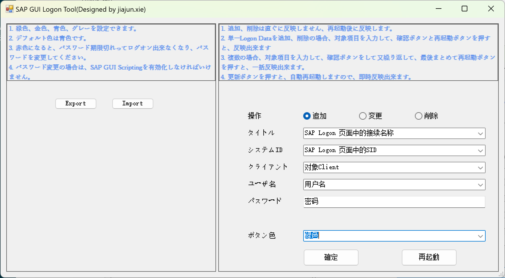

# SAP-Tool
这里包含了我开发的一些关于SAP的实用工具

## SAP Logon Tool
这是一个关于SAP快速登录的工具，它可以帮你省去每次选择系统，输入登录信息的烦恼。
当你长时间未登录时，忘记密码也不用担心，他会记录你最后一次更改的密码。
他支持多人协作，他会为每个Windows用户生成一个LogonData文件，上面记录者您的个人信息。
功能介绍

1. logon data追加功能

   > 该功能位于右侧画面，在操作选项中选择追加，填入下方的logon data信息，点击确定即可添加新的logon信息，
   >
   > 由于logon data并不会立刻反应，需要点击再启动按钮反映到左侧区域内。
   >
   > 追加多个logon data的情况下，只需要再最后一次点击再启动按钮即可一次反应到左边区域。

   

2. logon data修改功能

   > 该功能位于右侧画面，在操作选项中选择修改（默认选项），修改下方的logon data信息，点击确定即可修改logon信息，
   >
   > 密码和新密码一致的情况下不会修改系统的密码，密码和新密码不一致的情况下会修改系统密码。
   >
   > 由于logon data会立刻反应，不需要需要点击再启动按钮就可以反映到左侧区域内。

   

   

3. logon data删除功能

   > 该功能位于右侧画面，在操作选项中选择追加，填入下方的logon data信息，点击确定即可添加新的logon信息，
   >
   > 由于logon data并不会立刻反应，需要点击再启动按钮反映到左侧区域内。
   >
   > 删除多个logon data的情况下，只需要再最后一次点击再启动按钮即可一次反应到左边区域。

   

4. logon data导出功能

   > 该功能位于左侧画面，使用同一系统用户，在操作选项中选择Export，选择导出位置，即可将logon data数据全部导出到指定位置。
   >
   > 该功能为了应对系统用户更换时，导出导入操作。

5. logon data导入功能

   > 该功能位于左侧画面，在操作选项中选择Import，选择导入文件（使用导出功能获取的导出文件），即可将logon data数据全部导入。导入后需要再启动反应到左侧区域。
   >
   > 该功能为了应对系统用户更换时，导出导入操作。

6. logon data加密功能

   > 当前工具会对logon data进行加密，只有同一系统用户才能进行解码。
   >
   > 不同系统用户不能混用logon data。
   >
   > logon data位于安装目录下logon data文件夹内的系统用户名.txt文件中。
